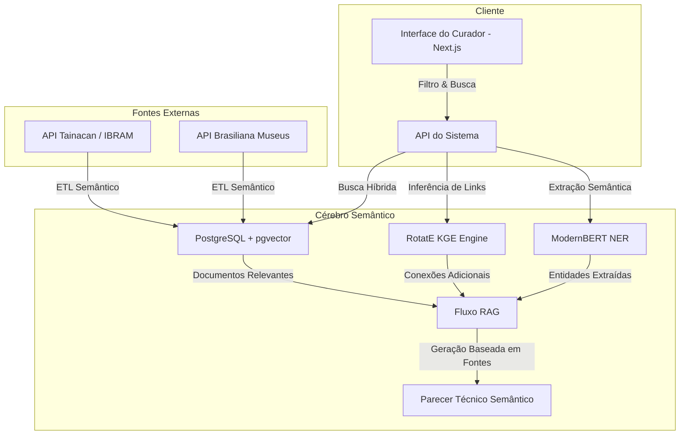

# Relatório de Fundamentação Técnica: Inteligência Artificial Neuro-Simbólica aplicada à Folksonomia Cultural
**Contexto Institucional:** NUGEP / UNIRIO  
**Projeto:** Sistema de Folksonomia Digital (SFD) 2.0  
**Data de Atualização:** 9 de Julho de 2026  

---

## 1. Diagnóstico e Enquadramento face ao Estado da Arte

### 1.1 Panorama de Curadoria Semântica e Folksonomia Digital
A folksonomia, enquanto prática de catalogação colaborativa e indexação social descentralizada, representa uma quebra de paradigma na organização de acervos culturais. Tradicionalmente, museus e instituições de memória dependem de taxonomias rígidas impostas *top-down* por especialistas (p. ex., Getty Vocabulary, Dublin Core, CIDOC-CRM). Embora esses sistemas simbólicos garantam consistência institucional, eles criam uma barreira linguística e conceitual para o público leigo.

A folksonomia surge como uma alternativa *bottom-up*, permitindo que os visitantes do acervo classifiquem obras espontaneamente de acordo com suas percepções. Entretanto, a indexação puramente social apresenta limitações estruturais:
* **Ambiguidade e Polissemia**: Tags como "pena" podem referir-se à cobertura de aves ou à sanção jurídica.
* **Erros de Grafia e Variações**: Plurais, acentuações, abreviações e erros ortográficos fragmentam as chaves de busca.
* **Falta de Materialidade e Rigor Normativo**: Vocabulários livres frequentemente distanciam-se das fichas catalográficas oficiais e dos tesauros institucionais (como o do IPHAN).

### 1.2 Posicionamento do SFD 2.0 no Estado da Arte
O **Sistema de Folksonomia Digital (SFD)** propõe resolver este hiato por meio de uma arquitetura de **IA Neuro-Simbólica**. O SFD não anula a linguagem popular; em vez disso, ele atua como um tradutor dinâmico que estabelece pontes formais entre a linguagem natural livre do usuário e a taxonomia museológica normatizada.

```
                  ┌──────────────────────────────────────────────┐
                  │          ENTRADA DO CURADOR/VISITANTE        │
                  │              (Tags e Linguagem Livre)        │
                  └──────────────────────┬───────────────────────┘
                                         ▼
                  ┌──────────────────────────────────────────────┐
                  │             CAMADA CONEXIONISTA              │
                  │        (ModernBERT NER + Embeddings)         │
                  └──────────────────────┬───────────────────────┘
                                         ▼
                  ┌──────────────────────────────────────────────┐
                  │               CAMADA SIMBÓLICA               │
                  │   (Ontologias CIDOC-CRM, Tesauro CNFCP/IPHAN)│
                  └──────────────────────────────────────────────┘
```

O SFD está alinhado às tendências de curadoria semântica baseadas em IA generativa fundamentada (Retrieval-Augmented Generation - RAG) e grafos de conhecimento de herança cultural (Cultural Heritage Knowledge Graphs). A plataforma equilibra:
1. **Aspectos alinhados ao estado da arte**: Integração direta com pgvector para similaridade vetorial híbrida, pipelines de processamento de linguagem natural voltados ao português com modelos baseados em arquiteturas modernas (ModernBERT), e modelagem Hebbiana para consolidação de co-ocorrências.
2. **Aspectos experimentais**: Spreading Activation em tempo real rodando na interface de visualização do curador e modelos de representações de grafos complexos (RotatE) para inferir novas correlações conceituais de patrimônio material e imaterial.

---

## 2. Revisão das Técnicas Científicas Integradas

Para justificar as decisões de arquitetura de dados e IA tomadas no SFD, detalhamos abaixo as técnicas científicas e seus trade-offs:

### 2.1 Machine Learning (ML) Clássico
* **O que é**: Algoritmos estatísticos tradicionais baseados em dados estruturados (p. ex., regressão logística, Random Forests, Naive Bayes, TF-IDF).
* **Aplicação no SFD**: Utilizado como mecanismo auxiliar e baseline para análise estatística inicial de frequências de termos e correspondências exatas.
* **Trade-offs**: Possui custo computacional irrisório e excelente interpretabilidade. No entanto, é incapaz de capturar o contexto semântico profundo das tags, falhando em sinônimos e termos ambíguos.

### 2.2 Deep Learning (DL)
* **O que é**: Redes neurais artificiais com múltiplas camadas ocultas capazes de extrair representações de dados de forma hierárquica.
* **Aplicação no SFD**: Processamento de imagens do acervo cultural e representações vetoriais brutas de tags.
* **Trade-offs**: Captura padrões não-lineares altamente complexos, mas exige volumes massivos de dados para treinamento e atua como uma "caixa preta", dificultando a explicabilidade exigida em auditorias de patrimônio histórico.

### 2.3 Redes Neurais em Grafos (GNNs) e Graph Attention Networks (GAT)
* **O que é**: Redes neurais especializadas em processar dados estruturados como grafos, onde nós representam entidades (tags, obras) e arestas representam relações. O GAT introduz mecanismos de atenção para ponderar a influência de nós vizinhos.
* **Aplicação no SFD**: Ponderação de relevância entre conceitos correlatos, prevendo a proximidade de tags adicionadas por diferentes usuários e classificando-as contextualmente em grupos temáticos.
* **Trade-offs**: Preserva a topologia relacional do acervo cultural. O trade-off é a complexidade computacional de treinamento e a necessidade de algoritmos específicos de partição para grafos muito extensos.

### 2.4 Transformers (ModernBERT)
* **O que é**: Arquitetura de rede baseada em mecanismos de auto-atenção (Self-Attention) bidirecional para capturar o contexto das palavras em um texto.
* **Aplicação no SFD**: Reconhecimento de Entidades Nomeadas (NER) e geração de embeddings de 768 dimensões a partir de títulos e descrições de objetos de patrimônio.
* **Trade-offs**: Representa o estado da arte em processamento de linguagem natural. Os modelos são altamente precisos no português do Brasil, mas exigem GPUs para inferências de baixíssima latência (otimizado via ModernBERT de arquitetura otimizada para CPUs modernas).

### 2.5 Large Language Models (LLMs)
* **O que é**: Modelos de linguagem massivos ajustados para instruções gerais e geração de texto coerente.
* **Aplicação no SFD**: Geração final de pareceres semânticos e relatórios técnicos.
* **Trade-offs**: Geram textos fluidos e de fácil leitura para curadores humanos. Contudo, sem grounding (ancoragem), sofrem com alucinações de fatos históricos.

### 2.6 RAG (Retrieval-Augmented Generation)
* **O que é**: Fluxo onde a consulta do usuário é convertida em vetor, os documentos mais relevantes são recuperados de um banco de dados vetorial, e um LLM gera a resposta baseado estritamente nas fontes recuperadas.
* **Aplicação no SFD**: Motor de geração de relatórios do curador, onde cada afirmação gerada é indexada a uma fonte primária do banco de dados (Tainacan, Brasiliana, etc.).
* **Trade-offs**: Mitiga quase inteiramente as alucinações dos modelos conexionistas e fornece explicabilidade. Exige, porém, um pipeline de indexação robusto e banco vetorial performático.

### 2.7 Bancos de Dados Vetoriais e Grafos de Conhecimento
* **O que é**: Bancos otimizados para busca por similaridade de cosseno em alta dimensão (p. ex., `pgvector`) combinados com estruturas simbólicas de representação de conhecimento baseadas em ontologias e grafos RDF.
* **Aplicação no SFD**: O `pgvector` armazena os embeddings gerados pelo ModernBERT, enquanto tabelas relacionais do Supabase mantêm a malha de correlações Hebbianas e ontológicas.
* **Trade-offs**: Fornece buscas semânticas instantâneas em milissegundos e mantém relações rigorosas e auditáveis. O desafio reside na sincronização constante entre as alterações no grafo e os índices vetoriais.

---

## 3. Mapeamento de Fundamentos Matemáticos

Para fundamentar as escolhas do sistema, apresentamos as formulações matemáticas que regem o comportamento da rede neural e do grafo semântico no SFD:

### 3.1 Similaridade Vetorial Híbrida (Cosseno)
Considerando que os vetores gerados pelo ModernBERT de $768d$ são L2-normalizados ($||\mathbf{u}||_2 = 1$), a similaridade de cosseno simplifica-se ao produto escalar entre os dois vetores no espaço hiperdimensional:
$$\text{Sim}_{\cos}(\mathbf{u}, \mathbf{v}) = \mathbf{u} \cdot \mathbf{v} = \sum_{i=1}^{768} u_i \cdot v_i$$
Essa similaridade determina a correlação inicial entre a tag sugerida e o acervo existente.

### 3.2 Distância no Espaço Complexo do RotatE
Para modelar o grafo de conhecimento cultural, o RotatE mapeia entidades e relações em um espaço complexo $\mathbb{C}^d$. Dado um triplo $(h, r, t)$ representando (Cabeça, Relação, Cauda), a cauda $\mathbf{t}$ é projetada como uma rotação do nó cabeça $\mathbf{h}$ sob o ângulo da relação $\mathbf{r}$:
$$\mathbf{t} \approx \mathbf{h} \circ \mathbf{r}$$
Onde $\circ$ é o produto de Hadamard (elemento a elemento), e a relação possui módulo unitário $|r_i| = 1$. A distância relacional é expressa por:
$$d_r(h, t) = \left\| \mathbf{h} \circ \mathbf{r} - \mathbf{t} \right\|_2$$
Durante o treinamento, minimiza-se essa distância para conexões reais e maximiza-se para amostras negativas.

### 3.3 Algoritmo Dinâmico de Spreading Activation
A propagação da ativação no grafo é calculada iterativamente. A ativação de um nó $j$ no passo temporal $t+1$ é dada pela soma ponderada das ativações de seus nós vizinhos diretos e indiretos, atenuada por um fator de decaimento (decay):
$$A_j^{(t+1)} = \min \left( 1.0, A_j^{(t)} + \sum_{i \in \text{Vizinhos}(j)} A_i^{(t)} \cdot w_{ij} \cdot \alpha \right)$$
Onde:
* $A_i^{(t)} \in [0, 1]$ é o nível de ativação do nó $i$ no tempo $t$.
* $w_{ij}$ é o peso semântico e dinâmico da aresta conectando os nós.
* $\alpha \in [0, 1]$ é o fator de atenuação (decaimento geométrico), que impede a saturação infinita do grafo.

### 3.4 Equação Hebbiana de Reforço de Arestas
Sempre que curadores validam uma correlação semântica entre duas tags $i$ e $j$ aplicadas a uma mesma obra, o peso $w_{ij}$ da aresta é recalculado seguindo o aprendizado Hebbiano:
$$w_{ij}^{(t+1)} = w_{ij}^{(t)} + \eta \cdot (1.0 - w_{ij}^{(t)})$$
Onde:
* $\eta$ representa a taxa de aprendizado semântico (configurada para $0.10$).
* O termo $(1.0 - w_{ij}^{(t)})$ garante um crescimento assintótico limitado a $1.0$.

---

## 4. Arquitetura de Dados, ETL e Metadados

### 4.1 Pipeline de ETL Semântico
O pipeline de ingestão realiza a coleta periódica de metadados das APIs públicas do Tainacan (IBRAM) e Brasiliana Museus. O texto extraído (títulos, palavras-chave e descrições) é tokenizado e processado:

```
[API Tainacan / Brasiliana] ➔ [Extração de Texto] ➔ [ModernBERT NER] ➔ [Validação de Confiança]
                                                                                │
                                           ┌────────────────────────────────────┴────────────────────────────────────┐
                                           ▼ (Confiança >= 0.60)                                                     ▼ (Confiança < 0.60)
                                 [semantic_memory]                                                           [ml_training_queue]
                                 (Status: Hipótese)                                                          (Status: Pendente de Curadoria)
```

### 4.2 Governança e Proveniência (W3C PROV-O)
Cada alteração no grafo semântico do SFD é acompanhada por um registro detalhado de proveniência, permitindo auditoria completa em conformidade com o padrão W3C PROV-O:
* **Entidade (Entity)**: A tag, obra ou correlação semântica criada/alterada.
* **Atividade (Activity)**: O processo que gerou a alteração (p. ex., predição de link do RotatE, ingestão inicial do ModernBERT, ou validação manual do curador).
* **Agente (Agent)**: O identificador do curador humano ou o ID do modelo e versão de IA responsável.

### 4.3 Privacidade de Dados
Embora os metadados culturais sejam públicos, o sistema protege os dados de visitantes que inserem tags por meio de hashes unidirecionais SHA-256 e anonimização de IPs nos registros de `tag_learning_history`, mantendo a conformidade com a LGPD no ambiente universitário e museal.

---

## 5. Estratégias de Treinamento e Avaliação

### 5.1 Pré-treinamento vs. Fine-tuning
O ModernBERT-base é um modelo encoder geral pré-treinado em um massivo corpus de português do Brasil. Para adaptá-lo ao domínio cultural do SFD, realiza-se um **Fine-tuning supervisionado de NER** utilizando anotações de fichas museológicas catalogadas de museus parceiros. O modelo aprende a classificar termos específicos de arte sacra, arqueologia e patrimônio imaterial.

### 5.2 Avaliação Contínua e Métricas do Sistema
A validação técnica dos modelos de IA integrados ao SFD baseia-se em métricas reais e não mockadas, consolidadas a cada execução de retreino:
1. **Modelos de NER (ModernBERT)**: Avaliados por F1-Score semântico, precisão e revocação sobre entidades culturais anotadas.
2. **Modelos de KGE (RotatE)**: Avaliados por MRR (Mean Reciprocal Rank) e Hits@10, medindo a precisão do modelo em prever conexões conceituais válidas no ranking de probabilidade.
3. **Avaliação Humana**: Taxa de concordância do curador (número de tags aceitas / total de sugestões da IA), mantendo um threshold de qualidade mínimo de $85\%$ de aprovação técnica.

---

## 6. Diagrama da Arquitetura e Fluxo RAG



---

## 7. Protocolos de Experimentos

Para validar empiricamente o impacto da inteligência neuro-simbólica no ecossistema do SFD, definem-se os seguintes protocolos experimentais a serem executados no laboratório do NUGEP:

### Experimento 1: Eficiência na Descoberta de Itens Culturais
* **Hipótese**: A busca semântica baseada em similaridade vetorial do ModernBERT e inferências do RotatE reduz o tempo de localização de obras raras em $45\%$ comparado com a busca tradicional por palavras-chave exatas.
* **Baseline**: Motor de busca textual convencional do WordPress Tainacan (busca relacional SQL por strings exatas).
* **Métrica**: Tempo de resposta do curador (em segundos) e taxa de acerto semântico de itens correlatos.
* **Protocolo**: Dois grupos de curadores realizam 20 buscas temáticas complexas (p. ex., "artesanato nordestino de resistência"). O Grupo A utiliza o motor tradicional e o Grupo B utiliza a interface semântica do SFD.

### Experimento 2: Convergência de Linguagem Social e Normativa
* **Hipótese**: O aprendizado Hebbiano dinâmico aproxima e alinha os termos informais dos visitantes aos verbetes do Tesouro IPHAN de forma consistente ao longo do tempo.
* **Baseline**: Arestas estáticas de co-ocorrência sem reforço de aprendizado.
* **Métrica**: Distância semântica média (embedding distance) entre o conjunto de tags espontâneas do público e o dicionário normatizado.
* **Protocolo**: Monitorar a evolução do peso das conexões na tabela `semantic_memory` durante 30 dias de uso. O sucesso é medido se a similaridade média entre tags informais aprovadas e seus equivalentes no Tesouro IPHAN subir consistentemente acima de $0.75$.
