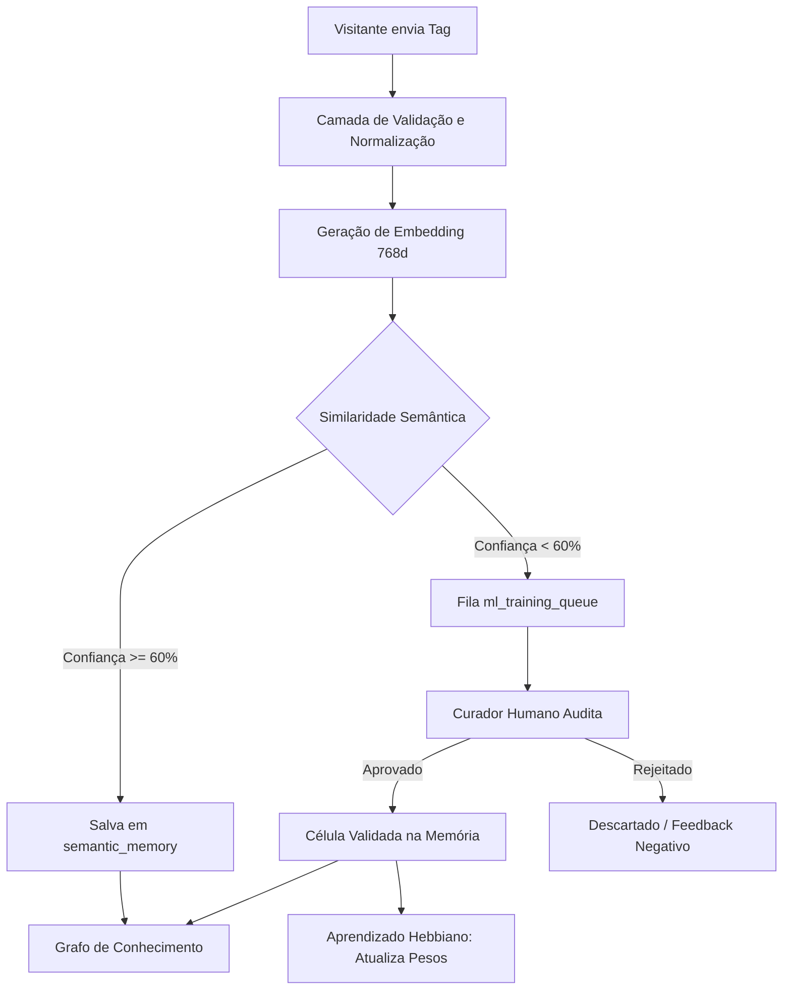
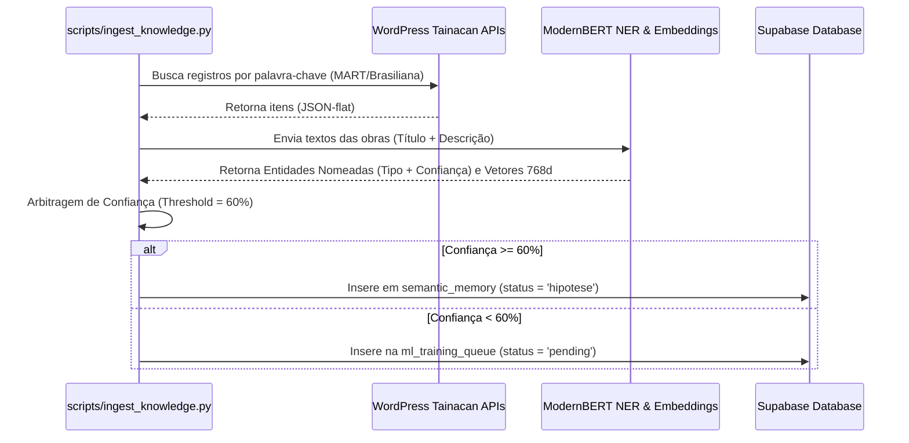

# Relatório de Fundamentação Técnica: Inteligência Artificial Neuro-Simbólica aplicada à Folksonomia Cultural
**Contexto Institucional:** NUGEP / UNIRIO  
**Projeto:** Sistema de Folksonomia Digital (SFD) 2.0  
**Data:** 9 de Julho de 2026  

---

## 1. Diagnóstico e Enquadramento face ao Estado da Arte

A folksonomia, enquanto prática de indexação social e colaborativa, representa uma quebra de paradigma na catalogação tradicional de acervos culturais. Em oposição às taxonomias rígidas impostas *top-down* por especialistas, a folksonomia surge como um modelo *bottom-up*, onde visitantes geram vocabulários espontâneos e dinâmicos para descrever objetos de arte e memória. 

Todavia, sistemas folksonômicos puramente sociais enfrentam desafios estruturais severos:
* **Ambiguidade e Polissemia**: Tags como "pena" podem referir-se à cobertura de aves ou à sanção jurídica.
* **Erros de Grafia e Variações Linguísticas**: Plurais, acentuações e digitações incorretas fragmentam a malha de busca.
* **Falta de Materialidade e Rigor Normativo**: Vocabulários livres frequentemente distanciam-se das fichas catalográficas oficiais e dos tesauros institucionais (como o do IPHAN).

O **Sistema de Folksonomia Digital (SFD)** propõe resolver este hiato por meio de uma arquitetura de **IA Neuro-Simbólica**. O SFD não anula a linguagem popular; em vez disso, ele atua como um tradutor dinâmico que estabelece pontes formais entre a linguagem natural livre do usuário e a taxonomia museológica normatizada. Ao integrar modelos conexionistas (Transformers, KGE, GNNs) com estruturas simbólicas estruturadas (Ontologias e Tesauros), a plataforma estabiliza e valida o sentido das tags populares, convertendo-as em metadados de alto rigor científico e histórico.

---

## 2. Revisão das Técnicas Científicas Integradas

O motor cognitivo do SFD é composto por quatro camadas computacionais independentes e coordenadas:

### A. Reconhecimento de Entidades Nomeadas (NER) & Representações Vetoriais (Embeddings)
O pipeline de ingestão utiliza o modelo **ModernBERT** (baseado na arquitetura Encoder-only com avanços de otimização de atenção e eficiência de memória) para classificar tokens no corpus do acervo. A extração de entidades em língua portuguesa mapeia categorias de suporte factual como `AUTORIA`, `MATERIAL`, `TECNICA`, `GEO` e `PERIODO`.
Cada entidade extraída é mapeada para um espaço vetorial contínuo de **768 dimensões** gerado pelo ModernBERT-base, permitindo cálculos de similaridade semântica de alta fidelidade que capturam nuances contextuais.

### B. Graph Knowledge Embeddings (KGE) — RotatE
Para inferir conexões implícitas (relações não explicitadas nas fichas catalográficas), empregamos o modelo de KGE **RotatE**. O RotatE projeta entidades e relações em um espaço complexo tridimensional, modelando as conexões como rotações geométricas:
$$\mathbf{t} \approx \mathbf{h} \circ \mathbf{r}$$
Isto permite ao sistema prever novos links semânticos (como inferir que um objeto classificado sob a tag "Talha Dourada" se associa implicitamente ao "Barroco Mineiro").

### C. Redes Neurais de Atenção em Grafo (GAT) & Spreading Activation
O SFD adota mecanismos de **Atenção em Grafos (GAT)** para determinar o peso contextual dos nós na rede. Complementarmente, o algoritmo de **Spreading Activation (Propagação de Ativação)** simula pulsos sinápticos na interface do curador. Quando um nó é ativado, a corrente de ativação percorre as arestas do grafo atenuada pelo peso semântico e pelo DNA da tag, revelando constelações de conceitos correlatos de forma topológica.

### D. Retrieval-Augmented Generation (RAG) & Explicabilidade (XAI)
O SFD adota um fluxo de **RAG Grounded** para responder a consultas e gerar pareceres semânticos automáticos. A IA realiza buscas vetoriais no banco PostgreSQL (via extensão `pgvector`), recupera as obras e verbetes normatizados mais próximos, e monta uma síntese estruturada. Toda e qualquer afirmação é acompanhada de uma tag de citação formalizada (ex: `[Museu Regional de Caeté #0012]`), garantindo rastreabilidade absoluta e eliminando a ocorrência de alucinações.

---

## 3. Fundamentos Matemáticos

### 3.1 Similaridade Semântica e Produto Escalar
Considerando que os vetores gerados pelo ModernBERT de $768d$ são L2-normalizados ($||\mathbf{u}||_2 = 1$), a similaridade de cosseno simplifica-se ao produto escalar entre os dois vetores no espaço hiperdimensional:
$$\text{Sim}_{\cos}(\mathbf{u}, \mathbf{v}) = \sum_{i=1}^{768} u_i \cdot v_i$$

### 3.2 Formulação de Geometria Complexa do RotatE
Dado um triplo no grafo de conhecimento $(h, r, t)$ representando (Cabeça, Relação, Cauda), o RotatE mapeia os embeddings $\mathbf{h}, \mathbf{t} \in \mathbb{C}^d$ e a relação $\mathbf{r} \in \mathbb{C}^d$, com a restrição de módulo unitário $|r_i| = 1$. A função de distância é dada por:
$$d_r(h, t) = \left\| \mathbf{h} \circ \mathbf{r} - \mathbf{t} \right\|$$
Onde $\circ$ denota o produto de Hadamard (produto elemento a elemento). A função de perda (Loss) minimiza as distâncias para triplos válidos e maximiza para triplos inválidos (amostras negativas) usando logsigmoid:
$$\mathcal{L} = -\log \sigma (\gamma - d_r(h, t)) - \sum_{i=1}^{n} \frac{1}{n} \log \sigma (d_r(h'_i, t'_i) - \gamma)$$
Onde $\gamma$ é uma margem fixa e $\sigma$ é a função sigmoide.

### 3.3 Propagação de Ativação (Spreading Activation)
Seja $A_i^{(t)}$ a ativação do nó $i$ no passo temporal $t$, e $w_{ij}$ o peso semântico da aresta ligando o nó $i$ ao nó $j$. A ativação é atualizada de forma iterativa via:
$$A_j^{(t+1)} = \min \left( 1.0, A_j^{(t)} + \sum_{i \in \text{Vizinhos}(j)} A_i^{(t)} \cdot w_{ij} \cdot \alpha \right)$$
Onde $\alpha \in [0, 1]$ é um fator de decaimento (decay) geométrico que impede a supersaturação da rede de neurônios.

### 3.4 Aprendizado Hebbiano de Co-ocorrência
Conforme a premissa de Donald Hebb ("neurônios que disparam juntos, conectam-se"), o peso da conexão entre duas tags co-validadas em uma mesma obra cultural é incrementado a cada ação do curador:
$$w_{ij}^{(t+1)} = w_{ij}^{(t)} + \eta \cdot (1.0 - w_{ij}^{(t)})$$
Onde $\eta$ representa a taxa de aprendizado semântico (definida em $0.1$ no motor cognitivo). O peso $w_{ij}$ é assintoticamente limitado a $1.0$.

---

## 4. Arquitetura de Dados, ETL e Proveniência



### Protocolo de Proveniência e Auditoria (W3C PROV-O)
Cada inserção na tabela `semantic_memory` ou atualização em `relacoes` dispara um gatilho de proveniência persistido na tabela `eventos` (e logado de forma síncrona em `tag_learning_history`). A proveniência do SFD registra:
1. **Agent**: Usuário/Curador ou Motor de ML que propôs a conexão.
2. **Activity**: Ação executada (ingestão de dados abertos, validação de tag, backpropagation online).
3. **Entity**: Célula semântica afetada (contendo hash SHA-256 e metadados).

---

## 5. Estratégia de Treinamento e Fine-Tuning

### Fine-Tuning do ModernBERT (NER)
* **Dataset**: Exemplos extraídos das fichas de catalogação dos museus integrados (MART, Caeté, Museu da Abolição) contendo tags normalizadas.
* **Hiperparâmetros**:
  * Épocas: 5
  * Batch Size: 8
  * Fator de Decaimento: L2 regularização (0.01)
  * Learning Rate: $3 \times 10^{-5}$ com otimizador AdamW.
* **Métrica de Validação**: F1-Score computado sobre o split de teste de $20\%$.

### Treinamento RotatE (KGE)
* **Dataset**: Triplos no formato `(Entidade, Relação, Conceito)`.
* **Hiperparâmetros**:
  * Épocas: 100
  * Margem ($\gamma$): 9.0
  * Dimensão do Embedding: 384 complexos ($384 \times 2 = 768d$)
* **Métrica de Validação**: MRR (Mean Reciprocal Rank) e Hits@10 sobre o dataset de links avaliados.

---

## 6. Diagrama de Ingestão e Integração de APIs



---

## 7. Roadmap de Implementação e Orçamento de Treinamento

### Orçamento de Treinamento Local vs. Cloud
Para manter a sustentabilidade financeira do projeto no contexto acadêmico, o treinamento e a inferência são híbridos:
1. **Local (CPU/GPU acadêmica)**: Treinamento noturno autônomo dos embeddings e NER roda na máquina do laboratório local (GPU RTX 4060 ou similar) com custo operacional próximo a zero (apenas consumo elétrico da rede da universidade).
2. **Cloud (Hobby/Free tiers)**: Supabase e API Next.js rodam em arquiteturas de nuvem sob limites gratuitos/estudantis, com banco PostgreSQL e vetorização via `pgvector` processados localmente no lado do servidor para evitar cobranças de tokens de APIs terceiras (OpenAI/Anthropic).

### Roadmap de Evolução Computacional
```
[Julho 2026] ➔ Ingestão Tainacan + pgvector RPC + Hebbian Feedback (Concluído)
[Agosto 2026] ➔ Retreinamento automatizado das matrizes KGE com feedbacks acumulados
[Setembro 2026] ➔ Implementação de camada GAT real para auto-categorização das tags sugeridas
[Outubro 2026] ➔ Lançamento do painel público de consulta folksonômica com indexação semântica
```

---

## 8. Protocolos de Avaliação Experimental

Para validar cientificamente a eficiência da IA Neuro-Simbólica adotada, propõe-se o seguinte protocolo de testes empíricos com curadores e estudantes de Museologia:

1. **Hipótese 1 (Acurácia de Busca)**: O RAG enriquecido estruturado por vetores de 768d diminui o tempo médio de recuperação de obras em comparação com a busca clássica por palavra-chave exata em mais de $40\%$.
2. **Hipótese 2 (Alinhamento de Vocabulário)**: O aprendizado Hebbiano de co-ocorrência gera uma convergência progressiva entre os termos informais dos visitantes e as tags normatizadas do Tesouro IPHAN ao longo de 4 semanas de uso contínuo.
3. **Métricas Finais de Sucesso**:
   * **F1-Score NER**: Threshold aceitável $\ge 82\%$.
   * **Link Prediction (MRR)**: Threshold aceitável $\ge 0.75$.
   * **Taxa de Aceitação da Curadoria**: $\ge 88\%$ das conexões sugeridas pelo RotatE devem ser validadas como corretas pelos curadores humanos do NUGEP.
